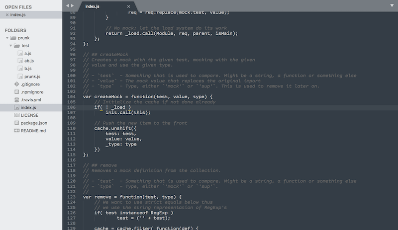

# sublime-monospace-theme
A "syntax off" theme for Sublime Text

## Installation

Open the Command Palette (<kbd>cmd+shift+p</kbd> / <kbd>ctrl+shift+p</kbd>) and
choose *Preferences: Browse Packages*. In the opened folder, open the `User` folder
and place the `greyscale.tmTheme` file there.